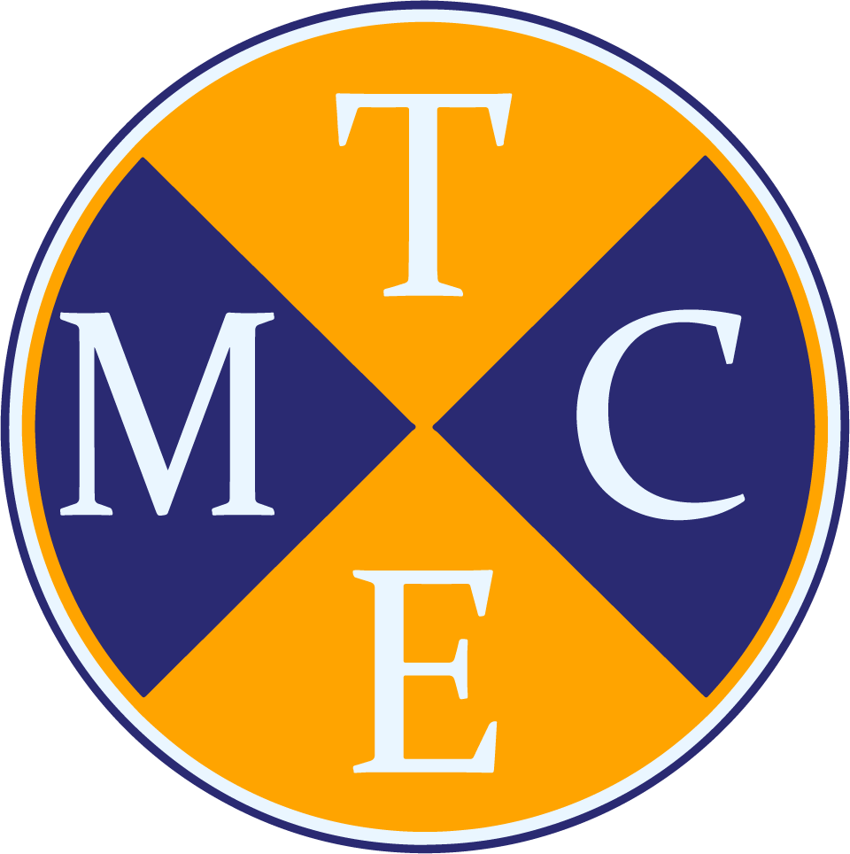

# Hola, bienvenido a mi portafolio.

### Mi nombre es Thomas Mujica

CEO TEMC Design

Desarrollador web Frontend, innovador, proactivo y con capacidad para desarrollar páginas web elegantes y pioneras y diseños de aplicaciones para clientes exigentes. Organizado, con experiencia en programación de proyectos, mejora de diseños y verificación del código. Habilidades de desarrollo web para una posición estimulante en una compañía moderna, abierta y profesional.

Como diseñador y desarrollador frontend, destaco por mi creatividad y pensamiento innovador, siempre buscando maneras originales de resolver problemas y crear experiencias únicas para los usuarios.

Mi conocimiento en diseño y composición me permite desarrollar interfaces que no solo son funcionales, sino también visualmente atractivas, utilizando teoría del color y tipografía de manera efectiva para mejorar la estética y la usabilidad. Además, tengo dominio de herramientas digitales y software de diseño, lo que me permite transformar conceptos creativos en productos digitales tangibles con precisión técnica y atención al detalle.
